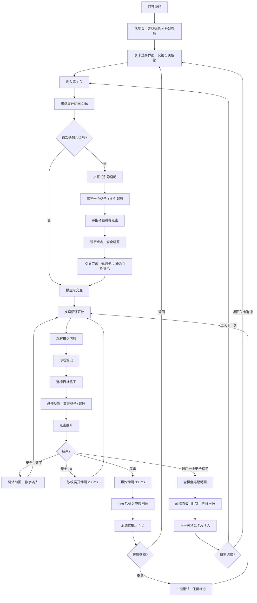
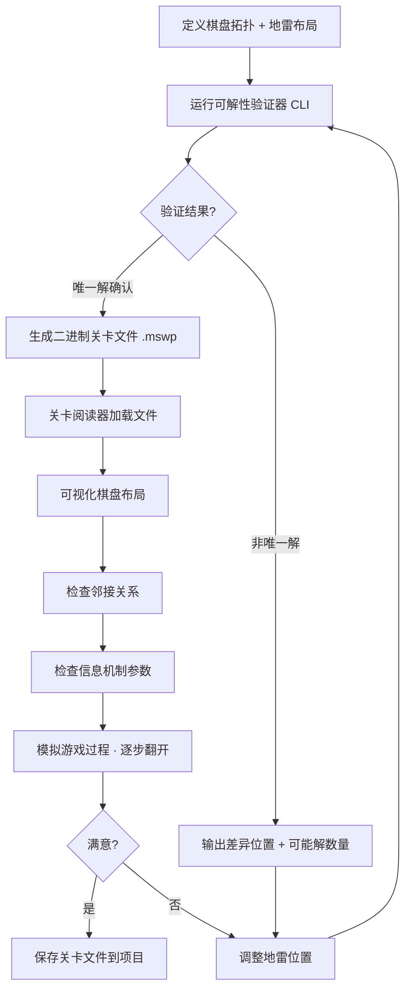
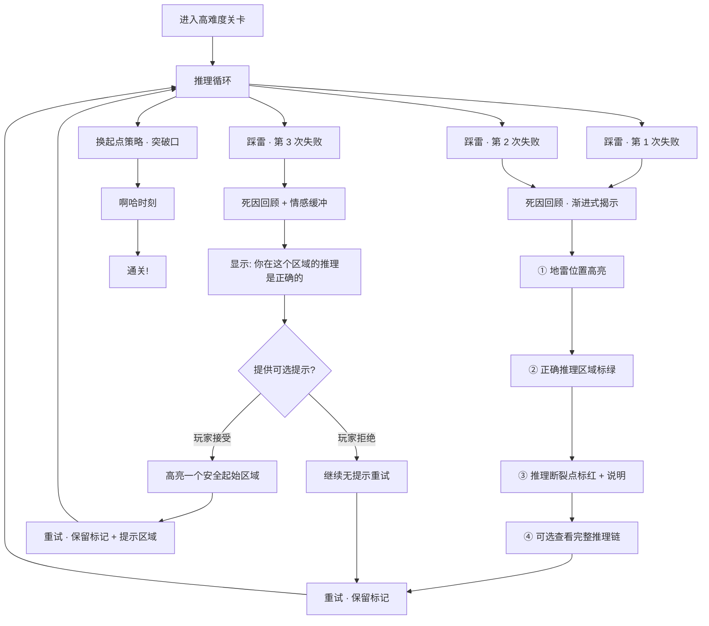
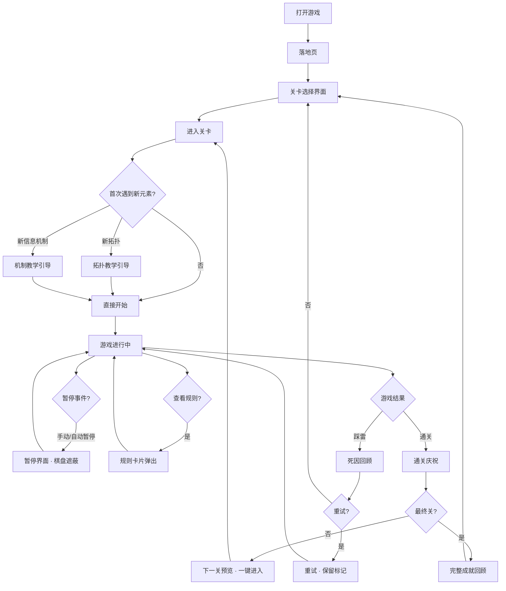

# UX Design Specification 高挑战性扫雷游戏

**Author:** Linyesh
**Date:** 2026-04-27

---

<!-- UX design content will be appended sequentially through collaborative workflow steps -->

## Executive Summary

### 项目愿景

高挑战性扫雷游戏是一款面向益智游戏爱好者的 Web 端扫雷变体，核心设计理念为"规则在变，逻辑永远成立"。通过引入非传统棋盘拓扑（六边形、三角形、环面、不规则图形、混合拓扑）和创新信息机制（模糊提示、延迟揭示），彻底重构经典扫雷的推理体验。

游戏采用 10 关线性递进制，每一关引入新的视觉或规则元素，从第一关起就制造新奇感。所有关卡保证唯一解——玩家面对的不是运气博弈，而是在全新规则框架下重建逻辑推理能力的智力挑战。

### 目标用户

**主要用户画像：益智游戏爱好者**
- 年龄段 20-35 岁，技术素养中等偏上
- 对经典扫雷有基础认知，渴望更深层推理挑战
- 喜欢逻辑解谜类游戏（数独、Hexcells、The Witness 等）
- 主要使用 Chrome 桌面端，部分场景使用移动端
- 追求"公平的高难度"——接受失败，但要求失败有据可查

**次要用户画像：关卡设计者（开发者本人）**
- 使用关卡阅读器和可解性验证器进行关卡设计
- 需要高效的设计-验证-迭代工作流

### 关键设计挑战

1. **拓扑认知负荷管理** — 5 种不同的棋盘拓扑要求玩家反复重建空间推理模型。每种新拓扑必须在 30 秒内被理解，同时保持挑战感。教学系统的设计是核心 UX 难题，需要在"不过度解释"和"不让玩家迷失"之间找到平衡。

2. **信息不确定性下的公平感知** — 模糊提示（范围值）和延迟揭示改变了信息获取方式。玩家在信息不完全时踩雷容易感到"不公平"。死因回顾必须通过分层揭示（地雷位置 → 信息充分区域 → 完整推理链）让玩家信服失败源于推理错误。

3. **非矩形交互适配** — 六边形、三角形、不规则图形的点击/触摸目标区域不规则，移动端需要精心设计缩放/平移手势和 hit-test 反馈，确保操作精度不成为体验瓶颈。

4. **难度曲线的情感节奏** — 10 关递进不仅是难度数值增长，更是情感体验编排。每关需要一个"啊哈时刻"，卡关时需要降低重试摩擦，通关时需要满足感释放。第 4 关附近的难度跳跃需要缓冲设计。

### 设计机会

1. **"先体验后命名"的教学范式** — 通过受限棋盘让玩家自己发现规则变化，而非文字解释。发现感本身就是游戏乐趣的一部分，可以将教学过程转化为核心体验。

2. **死因回顾作为学习工具** — 分层揭示设计把失败变成学习体验，降低挫败感的同时增强"再试一次"的动力。这是竞品中罕见的设计，可以成为差异化亮点。

3. **拓扑驱动的视觉语言** — 每种拓扑可以有独特的视觉风格和色彩主题，让玩家在视觉上就能感知"这是新的规则空间"，强化新奇感和关卡辨识度。

4. **通关过渡的冲动设计** — 利用通关后的成就感窗口，设计"再来一关"的触发点，维持游戏流（flow state）的连续性。

## Core User Experience

### 定义体验

本游戏的核心体验是：在不断变化的棋盘拓扑和信息规则下，进行确定性逻辑推理。

玩家最频繁的动作是"基于当前信息，决定翻开哪个格子"。这个决策循环包含认知和情感两个维度：

**认知循环：** 观察 → 推理 → 决策 → 翻开 → 获得新信息 → 继续推理

**情感循环：** 观察 → 形成假设 → 冒险验证（张力峰值：手指悬在格子上方的瞬间）→ 结果揭晓（释放或挫败）→ 调整策略

认知循环描述大脑在做什么，情感循环描述心在感受什么。两者必须同步流畅——认知上的摩擦会打断情感节奏，情感上的挫败会阻碍认知投入。

**体验质量的三个层面：**
- **空间感知** — 快速理解当前拓扑下每个格子的邻居关系
- **信息解读** — 准确理解数字、范围值或延迟状态的含义
- **决策执行** — 精准点击目标格子，零操作摩擦

### 平台策略

| 平台 | 优先级 | 输入方式 | 特殊考虑 |
|------|--------|---------|---------|
| Chrome 桌面端 | 主要 | 鼠标左键翻开 / 右键标记 | 精确点击，无需手势 |
| Chrome 移动端 | 次要 | 点击翻开 / 长按标记 | 缩放/平移手势，触摸目标区域适配，防误触机制 |

技术基础：Cocos2D 纯 Canvas/WebGL 渲染，静态 Web 部署，离线可用。所有 UI 由引擎 UI 系统实现，不依赖 HTML/CSS。

**移动端风险标注：** 非矩形格子（尤其三角形）的触摸目标区域可能小于推荐的 44px 最小触摸尺寸。需要在实现阶段验证各拓扑在移动端的可操作性，必要时对特定拓扑采用强制缩放或格子尺寸下限策略。

### 无摩擦交互

以下交互必须达到"零认知负荷"标准：

1. **翻开格子** — 点击到视觉反馈 < 100ms，玩家不应感知到任何延迟
2. **翻开预览（移动端）** — 手指按下但未抬起时高亮目标格子及其邻居，给玩家一个确认窗口，防止误触导致的非推理性失败
3. **自动展开** — 安全区域连锁展开以波纹动画呈现，200ms 内完成，视觉上清晰传达展开范围
4. **标记操作** — 右键/长按一步完成，支持撤销最近一次标记（防误操作）
5. **假设标记（Pencil Marks）** — 玩家可以在格子上标注假设状态（"可能是雷"/"可能安全"），辅助模糊提示下的推理过程，避免工作记忆溢出。这是模糊提示机制的必要配套交互
6. **规则查阅** — 规则卡片随时可查但不强制弹出，不打断推理思路
7. **重试流程** — 踩雷后一键重试，保留已有推理标记和假设标记，零摩擦回到推理状态
8. **暂停/恢复** — 切换标签页或来电自动暂停，返回后无缝恢复
9. **棋盘导航（移动端）** — 缩放/平移手势自然流畅，不与翻开/标记操作冲突

### 关键成功时刻

| 时刻 | 触发点 | 体验目标 | 设计要求 |
|------|--------|---------|---------|
| "这不是普通扫雷" | 第 1 关开始 10 秒内 | 新奇感 + 好奇心 | 六边形棋盘的视觉冲击 + 交互式引导的第一步 |
| "啊哈" | 每关至少一次 | 顿悟 + 成就感 | 关卡设计中嵌入推理突破点，让玩家自己发现规则而非被告知 |
| "原来如此" | 踩雷后死因回顾 | 理解 + 公平感 | 推理回放：高亮玩家第一个逻辑错误位置，展示"从这里开始推理链断了"，而非仅展示地雷分布 |
| "漂亮" | 通关瞬间 | 满足感释放 | 通关动画 + 成绩反馈（时间、尝试次数） |
| "再来一关" | 通关后 2-3 秒 | 持续动力 | 下一关预览 + 一键进入 |

### 难度曲线与情感节奏

10 关的难度曲线采用**波浪形递进**而非线性上升，在持续挑战中穿插呼吸空间：

| 关卡段 | 关卡 | 情感节奏 | 设计意图 |
|--------|------|---------|---------|
| 教学段 | 1-3 | 建立信心 → 小挑战 → 巩固 | 引入核心拓扑变化，让玩家建立"我能行"的信心 |
| 过渡段 | 4 | 呼吸 / 缓冲 | 用已学会的规则给一个轻松胜利，为中段蓄力 |
| 中段 | 5-7 | 升级 → 挑战 → 呼吸 | 引入信息机制变化，第 6 关后安排一个相对轻松的第 7 关 |
| 高潮段 | 8-10 | 组合挑战 → 终极考验 → 大满足 | 拓扑 + 信息机制组合，最终关给予最大的通关成就感 |

**关键设计约束：** 相邻两关之间不出现断崖式难度跳跃。每次引入新元素后，下一关应给玩家机会用新规则获得一次相对轻松的胜利。

### 情感安全网

确定性推理意味着每次失败都是个人的——没有运气可以怪罪。这比随机扫雷的情感负担更重。设计必须回应这一点：

- **推理回放（非简单展示）** — 死因回顾不仅展示地雷位置，更高亮玩家推理链断裂的具体位置，让失败归因于"这一步我漏看了"而非"我整个人不行"
- **渐进式揭示** — 死因回顾分层展示：地雷位置 → 玩家推理正确的区域（肯定已有成果）→ 错误位置 → 完整推理链
- **保留标记的重试** — 重试时保留所有推理标记和假设标记，传达"你之前的工作没有白费"
- **连续失败的情感缓冲** — 当玩家在同一关连续失败 3 次以上时，可考虑提供可选的提示（如高亮一个安全的起始区域），降低"我很蠢"的感受

### 体验原则

1. **推理优先，操作透明** — 所有交互设计的目标是让玩家注意力 100% 集中在逻辑推理上。格子状态、邻接关系、信息含义必须一目了然，操作本身不消耗认知资源。非推理性失败（误触、看不清、不理解规则）是设计缺陷，不是玩家问题。

2. **发现即乐趣** — 新规则的学习过程本身是游戏体验的核心部分。教学设计引导玩家自己发现变化，而非被动接受说明。每关的"啊哈时刻"是体验设计的首要目标。但需注意：发现的前提是安全感——玩家必须相信"我有足够的信息来解决这个问题"。

3. **失败是学习，不是惩罚** — 推理回放、保留标记的重试、渐进式揭示的死因回顾——所有失败相关设计让玩家感到"我学到了什么"而非"我被坑了"。确定性推理下的失败情感负担更重，设计必须主动提供情感安全网。

4. **节奏驱动沉浸** — 从翻开格子的微动画到通关的满足感释放，从卡关时的摩擦降低到"再来一关"的冲动触发，10 关体验是一条波浪形的情感曲线——持续挑战中穿插呼吸空间，避免线性疲劳。

### UX 风险登记

| 风险 | 严重度 | 受影响拓扑 | 缓解策略 |
|------|--------|-----------|---------|
| 非矩形格子触摸目标过小（移动端） | 高 | 三角形、不规则图形 | 强制最小格子尺寸 + 翻开预览确认 |
| 模糊提示下工作记忆溢出 | 高 | 所有 | 假设标记（Pencil Marks）功能 |
| 延迟揭示被误认为 bug | 中 | 所有 | 明确的"等待中"视觉状态 + 倒计时指示 |
| 环面 wrap-around 空间理解困难 | 中 | 环面 | 边缘视觉提示 + 交互式引导 |
| 纯 Canvas 渲染无障碍缺失 | 中 | 所有 | 高对比度配色 + 非纯色彩区分 + 键盘导航（桌面端） |
| 连续失败的情感累积 | 中 | 所有 | 推理回放 + 可选提示 + 渐进式揭示 |

## Desired Emotional Response

### 主要情感目标

本游戏的情感核心是**"智力掌控感"**——玩家在不断变化的规则中重建推理能力，每一次成功都是"我理解了这个世界的运作方式"的确认。这种感觉介于数独的沉静满足和密室逃脱的顿悟快感之间。

支撑核心情感的三个维度：
- **好奇心** — "这次又会变成什么？"（驱动探索）
- **张力** — "我的推理对不对？"（驱动投入）
- **顿悟** — "原来是这样！"（驱动满足）

### 情感旅程地图

| 阶段 | 期望情感 | 情感强度 | 设计触发 |
|------|---------|---------|---------|
| **首次发现**（打开游戏） | 好奇 + 期待 | ★★★☆☆ | 非标准棋盘的视觉冲击，"这不是普通扫雷" |
| **学习新规则**（每关开头） | 困惑（短暂）→ 好奇 | ★★☆☆☆ → ★★★☆☆ | 受限棋盘的交互式引导，困惑不超过 30 秒 |
| **推理过程中** | 专注 + 张力 | ★★★★☆ | 信息逐步揭示，假设形成与验证的循环 |
| **冒险点击** | 紧张 + 期待 | ★★★★★ | 手指悬在格子上方的瞬间——情感循环的张力峰值 |
| **安全翻开** | 释放 + 信心增长 | ★★★☆☆ | 即时视觉反馈 + 波纹展开动画 |
| **踩雷瞬间** | 惊讶 + 短暂挫败 | ★★★★☆ | 爆炸动画，但立刻过渡到死因回顾（不停留在挫败上） |
| **死因回顾** | 理解 + "原来如此" | ★★★☆☆ | 推理回放高亮错误位置，肯定正确推理区域 |
| **重试** | 决心 + "这次我知道了" | ★★★☆☆ | 保留标记的一键重试，零摩擦 |
| **通关瞬间** | 满足 + 成就感 | ★★★★★ | 通关动画 + 成绩反馈 |
| **关卡过渡** | 好奇 + "再来一关" | ★★★★☆ | 下一关预览 + 一键进入 |
| **连续失败（3次+）** | 挑战感（非挫败感） | ★★★☆☆ | 可选提示 + 渐进式揭示，维持"我能行"的信念 |
| **全部通关** | 深度满足 + 掌控感 | ★★★★★ | 完整成就回顾，"我征服了所有规则" |

### 微情感设计

| 情感对 | 目标状态 | 避免状态 | 设计手段 |
|--------|---------|---------|---------|
| 信心 vs 困惑 | 短暂困惑后快速建立信心 | 持续困惑导致放弃 | 交互式引导 + 规则卡片 + 教学关的高通关率 |
| 信任 vs 怀疑 | 相信每关都有唯一解 | 怀疑游戏有 bug 或不公平 | 死因回顾的推理回放 + 延迟揭示的明确等待状态 |
| 兴奋 vs 焦虑 | 面对新规则的兴奋感 | 面对未知的焦虑感 | "先体验后命名"的教学 + 波浪形难度曲线的呼吸关 |
| 成就 vs 挫败 | 每次通关的成就感 | 连续失败的挫败感 | 渐进式揭示肯定正确推理 + 可选提示 |
| 惊喜 vs 困扰 | 新拓扑带来的惊喜 | 规则变化带来的困扰 | 每种拓扑的独特视觉语言 + 渐进式规则引入 |
| 掌控 vs 无力 | "我理解了规则" | "我完全不知道该怎么办" | 假设标记辅助推理 + 死因回顾的学习功能 |

### 设计含义

**情感 → UX 设计映射：**

1. **好奇心 → 视觉新奇感设计** — 每种拓扑有独特的视觉风格和色彩主题。关卡选择界面展示下一关的拓扑轮廓（但不揭示具体规则），激发"这次是什么？"的好奇心。

2. **张力 → 交互反馈设计** — 手指/鼠标悬停在格子上时的微妙视觉反馈（高亮目标格子及其邻居），强化"我即将做出决策"的张力感。翻开后的即时反馈释放张力。

3. **顿悟 → 教学系统设计** — 不直接告诉玩家规则变了什么，而是通过受限棋盘让玩家自己发现。顿悟的快感来自"我自己想明白了"，而非"我被告知了"。

4. **公平感 → 失败反馈设计** — 推理回放必须让玩家看到"我的推理在哪里断了"，而非仅仅"地雷在哪里"。渐进式揭示先肯定正确推理区域，再展示错误，维护玩家的自尊。

5. **掌控感 → 信息透明设计** — 所有影响推理的信息必须可见且可理解。模糊提示的范围值、延迟揭示的等待状态、格子的邻接关系——没有隐藏信息（除了地雷位置本身）。

### 情感设计原则

1. **困惑是桥梁，不是目的地** — 短暂的困惑是通向顿悟的必经之路，但困惑不应持续超过 30 秒。如果玩家在 30 秒后仍然不理解新规则，说明教学设计失败了。

2. **张力需要释放** — 每一次紧张的决策后都需要明确的结果反馈。安全翻开的释放感和踩雷的惊讶感同样重要——它们共同构成情感循环的完整性。

3. **失败后的第一个情感不应是挫败** — 踩雷后玩家看到的第一个画面应该引导他走向"理解"而非停留在"失败"。死因回顾的入口设计比爆炸动画更重要。

4. **成就感需要对比** — 通关的满足感与之前的挑战成正比。波浪形难度曲线中的呼吸关不是降低体验，而是为下一个高峰蓄力。

5. **好奇心是最好的留存机制** — "下一关会是什么？"比任何成就系统都更有效。关卡过渡设计的核心任务是维持好奇心的连续性。

## UX Pattern Analysis & Inspiration

### 灵感产品分析

**1. 消消乐（Match-3 类）**
- 视觉风格：高饱和度色彩 + 圆润形状 + 丰富粒子特效，每次操作都有即时视觉奖励
- 交互手感：拖拽/点击的触觉反馈极其流畅，消除时的连锁动画创造"超出预期"的满足感
- 教学方式：前 3 关就是教学，但玩家不觉得自己在"学习"——手指引导 + 高亮提示 + 保证成功的关卡设计
- 情感节奏：每一步操作都有正反馈（音效 + 动画 + 分数跳动）

**2. 放置类游戏（Idle Games）**
- 视觉风格：简洁清晰的数值展示，进度可视化
- 交互手感：极低操作门槛，核心交互只有"点击"，但数值反馈让每次点击都有意义
- 留存机制："离开后还在进步"的感觉
- 渐进式复杂度：新机制逐步解锁，每次解锁都是一个小惊喜

**3. 数独**
- 视觉风格：极简、高对比度、网格清晰，数字可读性优先
- 交互手感：笔记模式（pencil marks）是核心辅助交互，填入数字的确认感
- 教学方式：从简单网格开始，规则不变但复杂度递增
- 失败反馈：即时冲突高亮（填入错误数字时相关区域变红），不需要等到最后才知道错了
- 专注感：界面极度克制，没有干扰元素，玩家注意力 100% 在网格上

### 可迁移的 UX 模式

**交互模式：**

| 来源 | 模式 | 迁移到本游戏 |
|------|------|------------|
| 数独 | 笔记模式（Pencil Marks） | 假设标记功能——在模糊提示下标注"可能是雷/可能安全"，与数独的笔记模式完全同构 |
| 数独 | 即时冲突高亮 | 翻开格子后，如果周围数字与标记产生矛盾，即时高亮冲突区域 |
| 消消乐 | 手指引导教学 | 交互式引导——高亮第一步操作位置，手指/箭头动画引导 |
| 消消乐 | 连锁反应动画 | 自动展开的波纹动画——安全区域连锁展开时的视觉满足感 |
| 放置类 | 渐进式解锁 | 关卡选择界面的解锁机制——每通一关解锁下一关 |

**视觉模式：**

| 来源 | 模式 | 迁移到本游戏 |
|------|------|------------|
| 数独 | 极简高对比度网格 | 棋盘渲染优先清晰度——格子边界清晰、数字/范围值高可读性 |
| 消消乐 | 操作即时视觉奖励 | 每次翻开格子都有微动画反馈（翻转、数字淡入、波纹） |
| 消消乐 | 高饱和度 + 圆润形状 | 适度借鉴——格子状态用饱和度区分，但整体偏向数独的克制 |
| 放置类 | 进度可视化 | 关卡选择界面显示完成状态、最佳时间、尝试次数 |

**教学模式：**

| 来源 | 模式 | 迁移到本游戏 |
|------|------|------------|
| 消消乐 | "前 3 关就是教学" | 教学段（1-3 关）本身就是教学，但玩家感觉在"玩游戏"而非"上课" |
| 消消乐 | 保证成功的教学关 | 教学关首次通关率 ≥ 90%，通过棋盘规模和地雷密度控制 |
| 数独 | 规则不变复杂度递增 | 每种拓扑内部先用小棋盘 + 少地雷让玩家熟悉 |
| 所有 | 边玩边教 | 不用文字弹窗，通过受限棋盘让玩家自己发现变化 |

### 应避免的反模式

| 反模式 | 来源 | 为什么避免 |
|--------|------|-----------|
| 文字弹窗教学 | 通病 | 打断游戏流，玩家会直接跳过 |
| 过度装饰的 UI | 消消乐负面 | 增加认知负荷，干扰推理专注 |
| 体力/生命值系统 | 消消乐付费模式 | 限制重试与"失败是学习"原则矛盾 |
| 随机生成关卡 | 扫雷变体通病 | 破坏唯一解保证和精心设计的难度曲线 |
| 计时器压力 | 竞速类数独 | 计时器应是记录工具而非压力来源 |
| 强制提示 | 部分数独 app | 提示应是玩家主动选择，非系统强制推送 |

### 设计灵感策略

**采纳（直接借鉴）：**
- 数独的笔记模式 → 假设标记功能（核心辅助交互）
- 消消乐的手指引导教学 → 交互式引导（边玩边教）
- 数独的极简高对比度网格 → 棋盘视觉风格基调
- 消消乐的连锁动画满足感 → 自动展开波纹动画

**适配（修改后借鉴）：**
- 数独的即时冲突高亮 → 适配为"标记与数字矛盾时的视觉提示"（不直接告诉答案，但提示逻辑冲突）
- 消消乐的视觉奖励密度 → 降低密度保持克制，但每步操作仍有微反馈
- 放置类的渐进解锁 → 关卡选择界面的解锁机制 + 进度可视化

**拒绝（明确不借鉴）：**
- 消消乐的付费/体力系统 — 与无限重试原则冲突
- 消消乐的过度装饰 — 与推理优先原则冲突
- 随机关卡生成 — 与唯一解保证冲突
- 计时器压力设计 — 计时器记录但不施压

**视觉风格定位：** 数独的克制 × 消消乐的手感 — 界面极简清晰（数独基调），但每步操作都有精致的微动画反馈（消消乐的手感）。整体感觉是"安静但有生命力"。

## Design System Foundation

### 设计系统选择

**方案：自定义轻量设计系统**

本项目使用 Cocos2D 纯 Canvas/WebGL 渲染，不依赖 HTML/CSS，因此传统 Web 设计系统（Material Design、Ant Design、Tailwind UI 等）完全不适用。采用自定义轻量设计系统——设计令牌体系 + 少量可复用 Cocos2D Prefab 组件。

### 选择理由

1. **技术必然性** — Cocos2D 渲染环境下没有现成的 UI 组件库可用，所有 UI 元素通过引擎 UI 系统手动构建
2. **范围可控** — 游戏 UI 组件种类有限（按钮、卡片、面板、网格、动画），不需要企业级设计系统的完整性
3. **视觉独特性** — 每种拓扑需要独特的视觉语言，要求自定义设计
4. **单人开发效率** — 轻量设计系统比完整设计系统更适合单人维护

### 实现方案

**设计令牌体系（Design Tokens）：**

| 令牌类别 | 内容 | 关键考虑 |
|---------|------|---------|
| colors | 调色板 + 语义色彩（格子状态、拓扑主题色） | 高对比度，非纯色彩区分 |
| typography | 字体大小、行高、字重 | 数字/范围值的可读性优先，移动端 ≥ 14px |
| spacing | 间距系统（4px 基准网格） | 格子间距影响可点击区域 |
| animation | 动画时长、缓动曲线 | 翻开 100ms、波纹 200ms、过渡 300ms |
| shadows | 阴影/发光效果 | 格子悬停、高亮状态反馈 |

**核心 UI 组件（Cocos2D Prefab）：**

| 组件 | 用途 | 复用场景 |
|------|------|---------|
| CellNode | 单个格子的渲染和状态管理 | 所有拓扑的棋盘渲染 |
| ButtonBase | 通用按钮（含按下/悬停/禁用状态） | 菜单、关卡选择、死因回顾 |
| CardPanel | 信息卡片容器（圆角 + 阴影） | 规则卡片、成绩面板、提示面板 |
| OverlayMask | 半透明遮罩 + 内容容器 | 教学覆盖层、暂停界面、死因回顾 |
| ProgressBar | 进度条 | 关卡选择界面的进度展示 |
| ToastMessage | 短暂提示消息 | 操作反馈、状态提示 |

**拓扑视觉主题系统：**

| 拓扑 | 主题色调 | 格子形状 | 视觉特征 |
|------|---------|---------|---------|
| 六边形 | 蓝绿色系 | 正六边形 | 蜂巢感，有机 |
| 三角形 | 橙黄色系 | 正三角/倒三角 | 锐利，几何感 |
| 环面 | 紫色系 | 矩形（边缘发光） | 边缘 wrap 视觉提示 |
| 不规则 | 绿色系 | 多边形 | 自然，有机 |
| 混合 | 多色渐变 | 混合形状 | 区域色彩区分 |

### 定制策略

**一致性规则：**
- 所有格子状态（未翻开、已翻开、已标记、假设标记、延迟等待、模糊提示）在所有拓扑中使用相同的视觉语义（颜色 + 图标/形状辅助）
- 按钮、卡片、面板在所有界面中保持一致的圆角、阴影、间距
- 动画时长和缓动曲线全局统一

**灵活性规则：**
- 拓扑主题色可以独立变化，但必须通过设计令牌系统管理
- 格子形状由拓扑决定，但状态视觉表现（颜色、图标）保持一致
- 教学覆盖层的内容可以按关卡定制，但容器样式统一

## 定义核心体验

### 定义性体验

> **"在陌生的规则空间中，通过纯逻辑推理找到唯一安全路径"**

玩家会这样向朋友描述："这个扫雷每一关规则都不一样——棋盘形状变了，数字含义变了——但每关都有唯一解，你得重新想明白怎么推理。"

### 用户心智模型

**玩家带来的既有认知：**
- 经典扫雷的基础规则（数字 = 周围地雷数，右键标记）
- 矩形网格 + 8 邻居的空间模型
- "角落和边缘更安全"的直觉策略

**本游戏需要打破和重建的认知：**
- 邻居数量不再固定（6、3、12、可变）→ 数字的含义随拓扑变化
- 数字不再精确（模糊提示给范围值）→ 推理从精确约束变为范围约束
- 信息不再即时（延迟揭示）→ 需要管理"已知"和"待揭示"两种信息状态
- 没有安全角落（环面拓扑）→ 边缘策略失效

**关键认知转换点：** 玩家从"套用已知策略"到"重建推理框架"的瞬间——这就是每关的"啊哈时刻"。

### 核心体验成功标准

| 标准 | 指标 | 验证方式 |
|------|------|---------|
| "这就是对的" | 翻开安全格子时玩家感到确信而非侥幸 | 玩家在翻开前能说出推理依据 |
| "我变聪明了" | 每关通关后玩家感到推理能力提升 | 通关时间随重试次数递减 |
| "反馈是即时的" | 每次操作都有明确的视觉/听觉响应 | 操作到反馈 < 100ms |
| "规则是公平的" | 踩雷后玩家能理解自己的错误 | 死因回顾后玩家能指出推理断裂点 |
| "我想继续" | 通关后玩家主动进入下一关 | 关卡间流失率 < 20% |

### 创新模式 vs 既有模式

**既有模式（直接复用）：**
- 点击翻开 / 右键标记 — 经典扫雷交互，零学习成本
- 数字表示周围地雷数 — 核心语义不变，只是"周围"的定义变了
- 自动展开安全区域 — 经典扫雷的连锁展开
- 关卡选择 + 线性解锁 — 成熟的游戏进度模式

**创新模式（需要教学）：**

| 创新点 | 教学策略 | 熟悉隐喻 |
|--------|---------|---------|
| 非矩形拓扑 | 第一关用小型六边形网格，交互式引导高亮邻居关系 | "蜂巢"——自然界的六边形 |
| 模糊提示（范围值） | 首次出现时用 2 格迷你棋盘演示，范围值用颜色渐变暗示不确定度 | 数独的"候选数"概念 |
| 延迟揭示 | 首次出现时格子显示沙漏图标 + 倒计时数字 | 烹饪计时器——"还没好，等一下" |
| 假设标记 | 首次出现模糊提示时自动引导使用 | 数独的笔记模式 |
| 环面拓扑 | 边缘格子用发光连线指向对侧对应格子 | 吃豆人的屏幕穿越 |

### 体验机制详解

**1. 启动（Initiation）**
- 棋盘以动画方式展开（从中心向外扩展，0.5s）
- 新拓扑类型：交互式引导自动启动，高亮一个格子及其所有邻居，手指动画引导点击
- 新信息机制：用 2-3 格的迷你演示展示机制效果
- 引导完成后棋盘进入可交互状态

**2. 交互（Interaction）**
- **观察：** 扫视棋盘，识别已知信息（数字、范围值、标记）
- **推理：** 基于邻接关系和信息机制规则，推导安全/危险格子
- **假设：** 对不确定的格子使用假设标记（Pencil Marks）
- **决策：** 选择一个确信安全的格子
- **悬停反馈：** 鼠标悬停/手指按下时，目标格子及其邻居高亮（桌面端即时，移动端按下 150ms 后触发预览）
- **执行：** 点击/抬起手指翻开格子

**3. 反馈（Feedback）**

成功路径：
- 安全格子翻开：翻转动画（100ms）→ 数字/范围值淡入 → 如果是 0 则波纹展开（200ms）
- 延迟揭示格子：翻转动画 → 沙漏图标 + 倒计时 → N 步后数字淡入替换沙漏
- 假设标记冲突：新翻开的数字与已有假设标记矛盾时，冲突区域短暂闪烁提示

失败路径：
- 踩雷：短暂震动 + 爆炸动画（300ms）→ 0.5s 后自动过渡到死因回顾界面
- 死因回顾渐进式揭示：① 地雷位置高亮 → ② 玩家推理正确区域标绿 → ③ 推理断裂点标红 + 说明 → ④ 可选查看完整推理链

**4. 完成（Completion）**
- 最后一个安全格子翻开 → 全棋盘亮起动画（从翻开点向外扩散）→ 成绩面板滑入（时间、尝试次数）
- 2s 后下一关预览卡片从底部滑入（拓扑轮廓 + "第 N 关"标签），一键进入
- 最终关（第 10 关）：完整成就回顾（所有关卡通关数据 + "你征服了所有规则"）

## Visual Design Foundation

### 色彩系统

**主色调：蓝绿色系（Teal）**

| 色彩角色 | 色值 | 用途 |
|---------|------|------|
| 主色（Primary） | `#0D9488` (Teal 600) | 主要按钮、关键交互元素、选中状态 |
| 主色浅 | `#5EEAD4` (Teal 300) | 悬停状态、次要高亮 |
| 主色深 | `#0F766E` (Teal 700) | 按下状态、文字链接 |
| 主色极浅 | `#CCFBF1` (Teal 100) | 背景色调、已翻开格子底色 |

**语义色彩：**

| 语义 | 色值 | 用途 |
|------|------|------|
| 安全/成功 | `#10B981` (Emerald 500) | 通关反馈、推理正确区域 |
| 危险/地雷 | `#EF4444` (Red 500) | 踩雷爆炸、推理断裂点 |
| 警告/模糊 | `#F59E0B` (Amber 500) | 模糊提示范围值、假设标记 |
| 等待/延迟 | `#8B5CF6` (Violet 500) | 延迟揭示等待状态 |
| 中性/信息 | `#6B7280` (Gray 500) | 辅助文字、禁用状态 |

**格子状态色彩（所有拓扑通用）：**

| 格子状态 | 填充色 | 边框色 | 辅助标识 |
|---------|--------|--------|---------|
| 未翻开 | `#E2E8F0` | `#CBD5E1` | 微妙凸起阴影 |
| 已翻开（安全） | `#F0FDFA` | `#99F6E4` | 平坦，数字显示 |
| 已标记（旗帜） | `#FEE2E2` | `#FCA5A5` | 旗帜图标 🚩 |
| 假设标记-可能雷 | `#FEF3C7` | `#FCD34D` | 问号图标 ❓ |
| 假设标记-可能安全 | `#DBEAFE` | `#93C5FD` | 圆点图标 ● |
| 延迟等待中 | `#EDE9FE` | `#C4B5FD` | 沙漏图标 ⏳ + 倒计时 |
| 模糊提示 | `#F0FDFA` | `#99F6E4` | 范围值 + 波浪下划线 |
| 踩雷（爆炸） | `#FEE2E2` | `#EF4444` | 地雷图标 💣 + 震动 |

**背景与界面色彩：**

| 元素 | 色值 | 说明 |
|------|------|------|
| 页面背景 | `#F8FAFC` | 极浅灰白 |
| 棋盘区域背景 | `#FFFFFF` | 纯白，突出格子 |
| 卡片/面板背景 | `#FFFFFF` | 白色 + 阴影 |
| 主要文字 | `#1E293B` | 深色，高可读性 |
| 次要文字 | `#64748B` | 中灰，辅助信息 |

**拓扑主题色：**

| 拓扑 | 主题强调色 | 应用方式 |
|------|-----------|---------|
| 六边形 | `#0D9488` Teal | 默认主色，蜂巢感 |
| 三角形 | `#F97316` Orange | 关卡标题栏 + 格子边框微调 |
| 环面 | `#8B5CF6` Violet | 边缘 wrap 发光线 + 标题栏 |
| 不规则 | `#22C55E` Green | 有机感，标题栏 + 格子边框 |
| 混合 | 渐变 Teal → Violet | 区域过渡色 + 标题栏 |

### 字体系统

**字体选择：**

| 角色 | 字体 | 备选 | 说明 |
|------|------|------|------|
| 主字体（中文） | Noto Sans SC（思源黑体） | PingFang SC, Microsoft YaHei | 圆润、现代、中文覆盖完整、免费开源 |
| 数字专用 | Nunito | Quicksand, Varela Round | 圆润无衬线，数字辨识度高 |

**字号层级（4px 网格）：**

| 层级 | 字号 | 字重 | 行高 | 用途 |
|------|------|------|------|------|
| H1 | 32px | Bold (700) | 40px | 游戏标题 |
| H2 | 24px | SemiBold (600) | 32px | 关卡标题、界面标题 |
| H3 | 18px | SemiBold (600) | 24px | 面板标题、规则卡片标题 |
| Body | 16px | Regular (400) | 24px | 正文、规则说明、按钮文字 |
| Caption | 14px | Regular (400) | 20px | 辅助信息、计时器 |
| 格子数字 | 20px | Bold (700) | — | 精确数字（Nunito） |
| 格子范围值 | 16px | SemiBold (600) | — | 模糊提示（Nunito） |
| 格子倒计时 | 12px | Medium (500) | — | 延迟揭示倒计时（Nunito） |

移动端适配：格子数字最小 14px，缩放后不低于此阈值。

### 间距与布局基础

**间距系统（4px 基准）：**

| 令牌 | 值 | 用途 |
|------|-----|------|
| xs | 4px | 格子内文字与边缘 |
| sm | 8px | 紧凑元素间距 |
| md | 16px | 标准元素间距、卡片内边距 |
| lg | 24px | 区块间距 |
| xl | 32px | 主要区域间距 |
| 2xl | 48px | 页面级间距 |

**布局原则：**
1. 棋盘居中 — 棋盘始终在屏幕中央，UI 元素分布在棋盘周围不遮挡
2. 信息层级 — 棋盘是视觉焦点，UI 控件退居次要位置
3. 触摸友好 — 所有可交互元素最小触摸区域 44×44px
4. 响应式 — 桌面端棋盘固定尺寸居中；移动端填满宽度，支持缩放/平移

**圆角系统：**

| 元素 | 圆角 |
|------|------|
| 按钮 | 12px |
| 卡片/面板 | 16px |
| 输入框/标签 | 8px |
| 图标按钮 | 50% |

**阴影系统：**

| 层级 | 阴影 | 用途 |
|------|------|------|
| sm | `0 1px 2px rgba(0,0,0,0.05)` | 未翻开格子凸起 |
| md | `0 4px 6px rgba(0,0,0,0.07)` | 卡片、面板 |
| lg | `0 10px 15px rgba(0,0,0,0.1)` | 弹出层、覆盖面板 |
| glow | `0 0 12px rgba(13,148,136,0.3)` | 悬停高亮（主色发光） |

### 无障碍考虑

1. **对比度** — 所有文字与背景对比度 ≥ 4.5:1（AA 标准）
2. **非纯色彩区分** — 所有格子状态同时使用颜色 + 图标/形状辅助区分
3. **字号下限** — 移动端所有可读文字 ≥ 14px
4. **键盘导航（桌面端）** — Tab 在格子间移动，Enter 翻开，Space 标记，方向键导航邻居
5. **动画减弱** — 尊重 `prefers-reduced-motion` 设置，提供关闭动画选项

## Design Direction Decision

### 设计方向探索

生成了 8 个设计方向的 HTML 交互展示页面（`ux-design-directions.html`），覆盖产品的所有关键界面：

| 方向 | 界面 | 核心设计决策 |
|------|------|------------|
| A | 游戏棋盘 | 极简专注，棋盘居中，UI 退居边缘 |
| B | 关卡选择 | 10 关网格，拓扑图标 + 渐进解锁 + 进度条 |
| C | 死因回顾 | 4 步渐进式揭示（地雷 → 正确推理 → 断裂点 → 推理链） |
| D | 教学引导 | 交互式覆盖层，高亮目标格子 + 手指动画 |
| E | 规则卡片 | 独立卡片，含拓扑/机制的迷你示例 |
| F | 通关庆祝 | 成绩反馈 + 下一关预览卡片 |
| G | 移动端 | 底部工具栏 + 翻开预览 + 44px 触摸区域 |
| H | 全景对比 | 关键界面并排验证视觉一致性 |

### 选定方向

采用统一视觉体系——所有方向不是互斥选择，而是同一产品的不同界面，共同构成完整的视觉系统。

### 设计理由

1. **棋盘为中心** — 游戏界面中棋盘占据最大视觉权重，UI 控件（计时器、地雷计数、工具按钮）退居顶部/底部边缘，不遮挡推理区域
2. **状态即色彩** — 每种格子状态有独特的颜色 + 图标组合，跨所有拓扑保持一致，玩家无需重新学习状态含义
3. **渐进式信息** — 死因回顾的 4 步揭示、教学的先体验后命名、关卡的渐进解锁——信息按需展示，不一次性压倒玩家
4. **圆润友好** — 12-16px 圆角、柔和阴影、Noto Sans SC 圆润字体——视觉上传达"安全感"，与"失败是学习"的情感原则一致
5. **移动端降级而非妥协** — 移动端有独立的底部工具栏和翻开预览机制，是针对触摸场景的专门设计，而非桌面端的缩小版

### 实现方案

**界面清单（按实现优先级）：**

| 优先级 | 界面 | 复杂度 | 依赖 |
|--------|------|--------|------|
| P0 | 游戏棋盘（桌面端） | 高 | 拓扑渲染引擎 |
| P0 | 关卡选择 | 低 | 进度持久化 |
| P1 | 死因回顾 | 中 | CommandLog 回放 |
| P1 | 教学引导覆盖层 | 中 | 关卡配置 |
| P1 | 规则卡片 | 低 | 无 |
| P1 | 通关庆祝 | 低 | 无 |
| P2 | 移动端适配 | 高 | 桌面端完成后 |

**Cocos2D 实现映射：**
- 格子状态色彩 → CellNode Prefab 的 Sprite 颜色切换
- 圆角卡片 → Cocos UI 的 Sprite + 9-slice
- 覆盖层 → BlockInputEvents + 半透明 Sprite
- 动画 → Cocos Tween 系统（翻转、波纹、滑入）

## User Journey Flows

### 旅程一：首次体验流程

从打开游戏到通关第 1 关的完整流程：

### 旅程二：关卡设计者工作流

### 旅程三：卡关与恢复流程

### 旅程四：游戏全局流程

### 旅程模式

| 模式 | 描述 | 出现场景 |
|------|------|---------|
| 渐进式揭示 | 信息分步展示，不一次性压倒 | 死因回顾 4 步、教学引导、关卡解锁 |
| 零摩擦重试 | 失败后一键回到推理状态 | 踩雷→重试、卡关→重试 |
| 上下文保持 | 状态跨操作保留 | 重试保留标记、暂停恢复、中断恢复 |
| 情感缓冲 | 失败后先肯定再纠正 | 死因回顾先标绿正确区域、连续失败提供可选提示 |
| 好奇心驱动 | 用未知激发探索欲 | 锁定关卡显示拓扑轮廓、通关后下一关预览 |

### 流程优化原则

1. **最短路径到价值** — 从打开游戏到第一次翻开格子不超过 3 次点击
2. **失败路径比成功路径更重要** — 踩雷后的体验决定玩家是否继续
3. **每个分支都有出口** — 任何界面都能返回，任何失败都能重试，任何教学都能跳过
4. **状态永不丢失** — 暂停、中断、切换标签页——推理进度永远安全

## Component Strategy

### 自定义组件规格

**1. CellNode — 格子节点（核心组件）**

- 用途：单个格子的渲染、状态管理和交互响应
- 状态：unrevealed, revealed, flagged, pencil-mine, pencil-safe, delayed, fuzzy, mine
- 交互：桌面端左键翻开/右键标记/悬停高亮；移动端点击翻开/长按标记/按下预览
- 变体：形状由拓扑决定（六边形/三角形/矩形/多边形），状态视觉跨拓扑一致
- 无障碍：键盘可聚焦，Enter 翻开，Space 标记
- 动画：翻转 100ms、标记切换 150ms、悬停缩放 1.05x、踩雷震动 300ms
- 子节点：数字 Label（Nunito）、图标 Sprite（旗帜/问号/沙漏/地雷）、高亮边框

**2. BoardRenderer — 棋盘渲染器**

- 用途：管理整个棋盘的布局、CellNode 实例化和交互分发
- 输入：ITopologyRenderer 实例 + 关卡数据
- 职责：根据拓扑类型排列 CellNode、处理自动展开波纹动画、管理对象池
- 交互：移动端缩放/平移手势、悬停时高亮目标格子及其邻居

**3. LevelCard — 关卡卡片**

- 状态：completed（绿色边框 + 星标）、current（主色边框 + 发光）、locked（半透明 + 锁图标）
- 内容：关卡编号、拓扑图标、关卡名称、最佳时间

**4. ReviewStepNav — 死因回顾步骤导航**

- 步骤：① 地雷位置 → ② 正确推理 → ③ 推理断裂点 → ④ 完整推理链
- 交互：点击步骤标签切换揭示层级，棋盘同步更新

**5. TutorialOverlay — 教学覆盖层**

- 组成：半透明遮罩 + 高亮区域 + 教学卡片 + 手指动画
- 行为：玩家完成引导操作后自动消失，跳过后不再重复

**6. RuleCard — 规则卡片**

- 组成：图标 + 标题 + 描述文字 + 迷你格子示例
- 触发：点击规则按钮弹出，点击外部收起

**7. CompletionPanel — 通关面板**

- 组成：庆祝图标 + 标题 + 统计卡片 + 下一关预览
- 动画：从底部滑入 300ms，统计数字跳动

**8. MobileToolbar — 移动端工具栏**

- 按钮：撤销标记、假设模式、规则卡片、暂停
- 规格：每个按钮 44×44px 最小触摸区域

**通用组件：** ButtonBase、CardPanel、OverlayMask、ToastMessage、ProgressBar、IconButton

### 组件实现策略

| 组件 | Cocos 实现方式 |
|------|--------------|
| CellNode | Prefab + cc.Component，Sprite 颜色切换 + Label 子节点 |
| BoardRenderer | cc.Component，管理 CellNode 实例池（NodePool） |
| ButtonBase | Prefab + Button 组件 + Sprite 状态切换 |
| CardPanel | Prefab + 9-slice Sprite（圆角）+ Layout |
| OverlayMask | BlockInputEvents + 半透明 Sprite |
| 动画 | cc.tween 系统（翻转、滑入、缩放、淡入淡出） |

### 实现路线图

| 阶段 | 组件 | 优先级 |
|------|------|--------|
| P0 核心 | CellNode + BoardRenderer | 最高——没有棋盘就没有游戏 |
| P0 核心 | ButtonBase + CardPanel + OverlayMask | 通用基础组件 |
| P1 流程 | LevelCard + ProgressBar | 关卡选择界面 |
| P1 流程 | CompletionPanel + StatCard | 通关体验 |
| P1 流程 | TutorialOverlay + HighlightMask | 教学系统 |
| P1 流程 | RuleCard + MiniCellExample | 规则查阅 |
| P1 流程 | ReviewStepNav + ReviewBoard | 死因回顾 |
| P2 适配 | MobileToolbar + ToolButton | 移动端工具栏 |
| P2 适配 | ToastMessage | 操作反馈提示 |

## UX Consistency Patterns

### 按钮层级

| 层级 | 样式 | 用途 | 示例 |
|------|------|------|------|
| 主要 | 实心蓝绿 `#0D9488`，白色文字，12px 圆角 | 核心行动，每界面最多 1 个 | "开始挑战"、"重试本关" |
| 次要 | 灰色填充 `#E2E8F0`，深色文字 | 辅助行动 | "返回关卡"、"撤销标记" |
| 图标 | 圆形 36px，灰色背景，悬停变蓝绿 | 工具操作 | 📖 规则、⏸ 暂停 |
| 文字链接 | 无背景，下划线，灰色 | 低优先级 | "跳过引导" |

### 反馈模式

| 场景 | 反馈方式 | 时长 |
|------|---------|------|
| 翻开安全格子 | 翻转动画 + 数字淡入 | 100ms |
| 自动展开 | 波纹动画（从翻开点向外扩散） | 200ms |
| 标记地雷 | 旗帜图标弹入 + 轻微缩放 | 150ms |
| 假设标记 | 图标淡入 | 100ms |
| 踩雷 | 震动 + 爆炸动画 → 0.5s 后过渡到死因回顾 | 300ms |
| 通关 | 全棋盘亮起 + 成绩面板滑入 | 500ms + 300ms |
| 操作错误 | 轻微抖动（无颜色变化） | 100ms |
| 标记冲突 | 冲突区域橙色边框闪烁 | 300ms × 2 |

规则：成功反馈用动画 + 颜色变化，错误反馈用物理运动。不使用文字弹窗。

### 导航模式

| 模式 | 过渡动画 | 时长 |
|------|---------|------|
| 关卡选择 → 进入关卡 | 缩放 + 淡入 | 300ms |
| 游戏中 → 死因回顾 | 爆炸后淡入 | 500ms 延迟 |
| 死因回顾 → 重试 | 快速淡出淡入 | 200ms |
| 通关 → 下一关 | 滑出 + 展开 | 300ms |
| 任意 → 关卡选择 | 滑出到右侧 | 200ms |

规则：所有界面转换有动画过渡，不硬切。返回操作始终可用。

### 覆盖层模式

| 类型 | 触发 | 遮罩 | 关闭方式 |
|------|------|------|---------|
| 教学引导 | 首次遇到新元素 | 60% 黑色 | 完成操作 / 跳过 |
| 规则卡片 | 点击 📖 | 60% 黑色 | 点击遮罩 / 关闭按钮 |
| 暂停 | 点击 ⏸ / 切换标签页 | 80% 黑色（棋盘不可见） | 点击"继续游戏" |
| 通关面板 | 通关自动触发 | 无遮罩，底部滑入 | 选择下一关 / 返回 |

### 格子状态视觉规范

| 状态 | 颜色 | 图标 | 交互 |
|------|------|------|------|
| 未翻开 | `#E2E8F0` | 无 | 可翻开/可标记 |
| 已翻开 | `#F0FDFA` | 数字 | 不可交互 |
| 已标记 | `#FEE2E2` | 🚩 | 可取消 |
| 假设-雷 | `#FEF3C7` | ❓ | 可切换/取消 |
| 假设-安全 | `#DBEAFE` | ● | 可切换/取消 |
| 延迟等待 | `#EDE9FE` | ⏳+数字 | 不可交互 |
| 模糊提示 | `#F0FDFA` | 范围值+波浪线 | 不可交互 |

规则：颜色 + 图标双重编码，不依赖纯色彩。所有拓扑使用相同状态视觉。

### 动画一致性

| 类型 | 时长 | 缓动 | 用途 |
|------|------|------|------|
| 即时反馈 | 100ms | ease-out | 翻开、标记 |
| 展开/收起 | 200ms | ease-in-out | 波纹、面板 |
| 过渡 | 300ms | ease-in-out | 界面切换 |
| 展示 | 500ms | ease-out | 棋盘展开、通关 |
| 强调 | 300ms × 2 | ease-in-out | 冲突闪烁 |

规则：尊重 `prefers-reduced-motion`，提供关闭动画选项。

## Responsive Design & Accessibility

### 响应式策略

**桌面端（主要平台）：**
- 棋盘固定逻辑尺寸居中显示，周围留白
- 格子大小：六边形 52×46px、三角形 48×42px（逻辑像素）
- UI 布局：顶部栏（关卡信息 + 计时器 + 工具按钮）+ 底部栏（地雷计数 + 操作按钮）
- 大屏幕棋盘两侧可常驻规则卡片

**移动端（次要平台）：**
- 棋盘填满屏幕宽度，支持缩放/平移
- 格子动态计算尺寸，最小触摸区域 ≥ 44px
- 顶部精简栏 + 底部固定工具栏（44px 高）
- 双指缩放/平移，单指点击翻开，长按标记
- 支持横屏和竖屏自动适配

**断点策略：**

| 屏幕宽度 | 模式 | 布局 |
|---------|------|------|
| ≥ 1024px | 桌面 | 棋盘固定居中，完整 UI |
| 768-1023px | 平板 | 棋盘略缩小，UI 精简 |
| < 768px | 移动 | 棋盘填满宽度，底部工具栏，翻开预览 |

**Cocos2D 适配：** `cc.view.setDesignResolutionSize()` + 桌面端 SHOW_ALL / 移动端 FIXED_WIDTH。

### 无障碍策略

**目标：WCAG 2.1 AA（在 Canvas 限制内最大化）**

**可实现的措施：**

| 类别 | 措施 | 优先级 |
|------|------|--------|
| 色彩对比 | 所有文字与背景 ≥ 4.5:1 | P0 |
| 非纯色彩 | 格子状态颜色 + 图标双重编码 | P0 |
| 字号下限 | 移动端所有文字 ≥ 14px | P0 |
| 触摸目标 | 所有可交互元素 ≥ 44×44px | P0 |
| 色盲友好 | 图标是主要标识，颜色是辅助 | P0 |
| 键盘导航 | Tab/Enter/Space/方向键完整操作 | P1 |
| 焦点指示 | 键盘聚焦格子有蓝绿发光边框 | P1 |
| 动画控制 | 尊重 prefers-reduced-motion + 关闭选项 | P1 |

**Canvas 限制：** 无屏幕阅读器支持（无 DOM）、无 ARIA 标签、文字不响应浏览器字号。落地页（HTML）提供基本信息，游戏内提供字号调整选项。

### 键盘导航规范

| 按键 | 功能 |
|------|------|
| Tab / Shift+Tab | 格子间移动焦点 |
| 方向键 | 邻居间移动（适配拓扑邻接） |
| Enter | 翻开格子 |
| Space | 标记/取消标记 |
| P | 切换假设标记模式 |
| R | 查看规则卡片 |
| Esc | 关闭覆盖层 / 暂停 |

### 测试策略

- 响应式：Chrome DevTools 设备模拟 + 实际设备（Android + iOS 各 1 台）
- 无障碍：键盘导航完整流程、色彩对比度验证、色盲模拟、reduced-motion 验证
- 注意：完整 WCAG 合规验证需要人工辅助技术测试和专业无障碍审查
